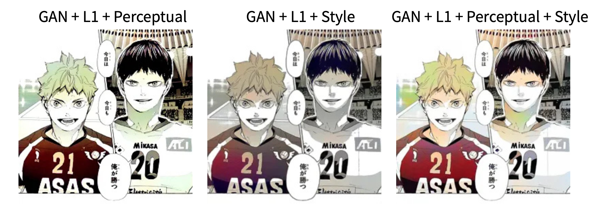

# Manga Colorization Project

This project explores how deep learning can be used to colorize black-and-white manga images.

Most manga are originally drawn in black and white. Coloring them manually takes a lot of time. In this project, I wanted to see if a model can learn how to generate color automatically from manga line art.

The main idea: **black-and-white manga image to colored manga image**

This project mainly focuses on **training experiments and exploring different ways to improve the model results**.

## Why I Used Pix2Pix

The **Pix2Pix GAN framework** is designed for image-to-image translation tasks.

In this project, the task is basically translating one image style into another:

black-and-white manga to colored manga

Pix2Pix works with two neural networks.

**Generator (U-Net)**  
The generator tries to create a colored image from the black-and-white manga input.

**Discriminator (PatchGAN)**  
The discriminator checks whether the generated image looks real or fake.

During training, the generator tries to fool the discriminator, and the discriminator tries to tell whether the image is real or fake.

## My Role in the Project

This project was completed as a team project.

My main responsibility was the **early experimentation stage and model exploration**.

I trained the baseline Pix2Pix model and tested different training conditions to understand how the model behaves on manga images.

I experimented with:
- different dataset sizes
- different training epochs
- baseline Pix2Pix training

After observing the results, I started exploring ways to improve the training process.

I experimented with adding **Perceptual Loss** and **Style Loss**, because I found that only using pixel loss sometimes produces blurry or unrealistic colors.

Later, I also tested **fine-tuning with additional manga images** to see whether the model could improve with more data.

I shared these observations with my teammates, and we continued developing the project together based on these ideas.

Most of the experiment notebooks in this repository were created during this exploration process.

## What I Learned

Through this project, I learned many practical things about deep learning and generative models:
- how GAN models work (generator vs discriminator)
- how Pix2Pix performs image-to-image translation
- how dataset size and training epochs affect results
- how perceptual loss can improve visual features
- how style loss helps maintain visual consistency
- how fine-tuning can improve a trained model
- how to build a simple **Gradio interface** to test a trained model

This project helped me understand the full workflow of training and testing a deep learning model.

## Experiments

I tried several training strategies.

### Baseline Pix2Pix

I trained a basic Pix2Pix model to see how well it could colorize manga images.

This helped me understand the basic behavior of the model.

### Perceptual Loss and Style Loss

I experimented with adding perceptual loss and style loss.

Instead of only comparing pixel values, perceptual loss compares higher-level visual features extracted from a pretrained network.

This sometimes helped the model produce more natural-looking colors.

### Fine-Tuning

I tested fine-tuning using additional manga images.

Fine-tuning helped the model adapt to the dataset and sometimes produced more stable results.

## Results

Some example results can be found in the `results` folder.

The results include outputs from:
- baseline Pix2Pix training
- perceptual and style loss training
- fine-tuned models

The results are not perfect, but some examples show that the model can generate reasonable colors and structures.

This also shows that manga colorization is still a challenging task, especially when the input style is different from the training dataset.

## Demo

I also built a simple **Gradio interface** to test the trained model.

Users can upload a black-and-white manga image, and the model will generate a colorized version.

A demo video of the Gradio interface is available in the `demo` folder.

## Conclusion

This project explores how deep learning models can be applied to manga colorization.

Through multiple training experiments, I learned how different training strategies affect the results and how generative models can be used for creative image tasks.
